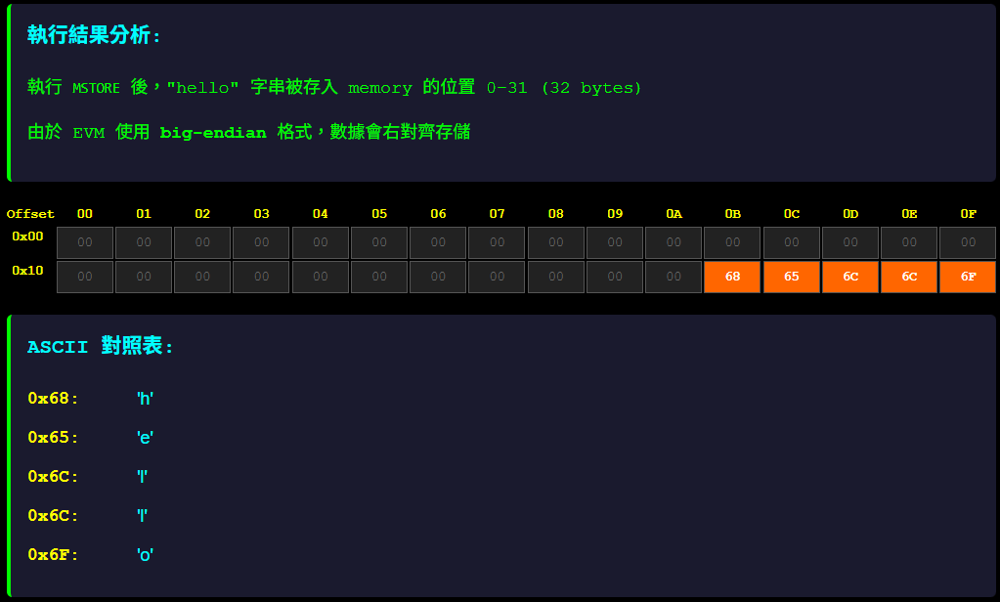

# Simple EVM

<br>

✅ Stack(32 bit) + Arithmetic Opcode 模擬

✅ 支援 Memory 操作（MLOAD, MSTORE）

✅ 支援 Gas 模型

✅ 支援跳轉指令（JUMP, JUMPI）

✅ PUSHx 系列自動化

✅ 支援 DUP/SWAP

✅ 支援 Storage 模擬 (實際版本需要依賴區塊鏈，暫時 SKIP 用 HashMap 模擬)

✅ CALL / RETURN 模型，支援呼叫內部 function / 合約

✅ LOG 模擬：支援類似 Solidity 的 event 紀錄

🔜 寫 bytecode 編譯器（高階語言轉 bytecode） 2025/07/06


<br>

---

### 在真實的 EVM 裡：

JUMP: 無條件跳轉到某個 offset（跳轉目的地）
➜ Stack: [dest] → JUMP → pc = dest

JUMPI: 條件跳轉，當條件不為 0 時才跳轉
➜ Stack: [dest, condition] → JUMPI → if (condition != 0) pc = dest else pc++

✅ 跳轉目的地必須是 JUMPDEST，否則會 Revert。

<br>

### 📘 EVM 中的 Gas 是什麼？

在 Ethereum 中，每條指令都會消耗 Gas。當合約執行時，會累計使用的 Gas。若 Gas 用盡，EVM 就會中止執行並 Revert 所有變更。

* 每條指令設定基本的固定 Gas 消耗
* 實作 Gas 計數器：初始化 → 每執行一條指令扣除對應 Gas
* 加入 Gas 不足時拋出錯誤（模擬 out of gas）
* Revert 時恢復 Gas 狀態

<br>

### DUPx / SWAPx

🔁 DUPx / SWAPx 概念簡介
✅ DUPx (0x80 ~ 0x8f)
DUP1 把 stack 的頂部複製一份，推到上面

DUP2 複製的是第 2 個（從頂部數下來）…

DUP16 是複製第 16 個元素

範例：

```text
stack = [5, 10, 15]
DUP2 → 複製 10，stack = [5, 10, 15, 10]
```

🔄 SWAPx (0x90 ~ 0x9f)
SWAP1 把 top 與第 2 個交換

SWAP16 把 top 與第 17 個交換

範例：

```text
stack = [5, 10, 15]
SWAP2 → stack = [15, 10, 5]
```

<br>

### 簡化 CALL 支援

🎯 功能設計目標：
支援使用 CALL opcode 呼叫「另一段 bytecode」作為目標函式執行

✅ 每個 CALL 執行都使用新的 SimpleEVM 執行子程式 (獨立的 stack, memory, storage, storage is unique by contract address)

✅ 模擬 CALL 的 Gas forwarding (目前沒想到怎麼做沒用完的 Gas 歸還，暫時就吃掉吧... XD)

✅ 子合約執行成功則回傳值到 stack

✅ 子合約失敗（OOG, exception）→ stack 推 0 表示失敗

### CALL/RETURN

EVM 是基於 "message call" 模型：每個 CALL 都是一個新的上下文（stack, memory, storage...）

實作 CALL/RETURN 之後，你就能模擬：

函式呼叫（例如 Solidity 的 function）

合約間互動（可模擬內部呼叫，未來支援多合約）

這是一個進入 合約架構與 ABI 模擬 的關鍵橋梁

在設計 bytecode 編譯器前，有 CALL/RETURN 才能產生 可重用邏輯與函式結構

✅ 設計重點

📦 CALL 呼叫一段「bytecode offset」開始的邏輯區塊（模擬 function 呼叫）

🔁 RETURN 將控制權返回到 CALL 的下一行，並還原 stack/memory

🧱 CallFrame 保存 returnPC、stack snapshot、memory snapshot、gas

💾 單一 code 區 同一份 bytecode 中跳到某段邏輯區塊執行（無多合約）

🧠 CALL 操作語意

```
Stack: [call_offset, return_offset]
CALL

→ push current context (stack, memory, pc, gas) into callStack
→ set pc = call_offset
```

🧠 RETURN 操作語意

```
RETURN

→ pop context from callStack
→ restore stack, memory, gas, pc = return_offset
```

### 與 Stack/Memory 的對比

數據位置隔離級別生命週期Stack每個 CallFrame調用結束即銷毀Memory
每個 CallFrame調用結束即銷毀Storage每個合約地址永久存儲（直到合約被銷毀）CallData每個 CallFrame調用期間只讀

實際應用場景:

```
當合約 A 調用合約 B 時：

A 和 B 各自有獨立的 Storage 空間
A 無法直接讀取或修改 B 的 Storage
B 也無法直接讀取或修改 A 的 Storage
如果需要數據交換，必須通過函數調用和返回值
```

<br>

## LOG - Solitidy Event 模擬

在 EVM（Ethereum Virtual Machine）中，LOG 指令是用來實作 Solidity 中的 event，
而這些 event 並不會影響 EVM 的 狀態（state），但在 Ethereum 的執行架構中扮演了非常重要的「鏈上鏈下溝通橋樑」角色。

* LOGn opcode:	實作 event 的基礎，最多支援 4 個 topic (LOG0~LOG4)
* 對狀態影響:	不會改變狀態（state），只是寫入 logs
* 儲存位置:	儲存在交易 receipt 裡，不存在合約 storage 或 memory 中
* 應用場景:	提供 DApp 監聽事件、查帳、索引搜尋、前端反應狀態等功能

### LOG 在 Frame Stack 中的角色與流程

在一筆交易被執行時，會建立一個 call stack frame。這個 frame 裡包含：

* Stack
* PC (program counter)
* Memory
* Storage
* gasRemaining
* return data buffer
* logs（event）

當 Solidity 執行 emit Event(...) 時，EVM 會將這個資訊從 stack/memory 中取出並執行 LOGn 指令，
將該事件資訊加到 logs list 中。這個 list 是交易 receipt 的一部分。

舉例:

1. emit Event：Solidity 轉成 LOG opcode，例如：

    ```solidity
    event Transfer(address indexed from, address indexed to, uint256 value);
    emit Transfer(msg.sender, receiver, amount);
    ```
    
    對應的 opcode 會是 LOG3（兩個 indexed topic + data）

2. LOG opcode 執行：EVM 從 memory 中取出資料（data offset 和 size），
     從 stack 取出 topic（indexed 參數），並寫入當前 call frame 的 logs 區域。

3. 結束 call frame 時：這個 frame 的 logs 被上層聚合，或作為 transaction receipt 的 logs 輸出。

### LOG 儲存位置與存取

這些 logs 不在 storage 中，不能從合約內讀取。

它們被 Ethereum client（如 Geth）記錄在交易 receipt 裡，可以透過 RPC 或 Web3 API 查詢


---


<br>

已經實現的 OPCODE:

```
    STOP((byte) 0x00, 0, StopExecutor.class),

    // Arithmetic operations (0x01 ~ 0x04)
    ADD((byte) 0x01, 3, ArithmeticExecutor.class),
    MUL((byte) 0x02, 5, ArithmeticExecutor.class),
    SUB((byte) 0x03, 5, ArithmeticExecutor.class),
    DIV((byte) 0x04, 5, ArithmeticExecutor.class),

    ISZERO((byte) 0x15, 3, ArithmeticExecutor.class),

    // PUSH1 ~ PUSH4 (32bit stack push opcodes)

    // 0x60 represents PUSH1, which pushes 1 byte onto the stack
    PUSH1((byte) 0x60, 3, PushExecutor.class),
    PUSH2((byte) 0x61, 3, PushExecutor.class),
    PUSH3((byte) 0x62, 3, PushExecutor.class),
    PUSH4((byte) 0x63, 3, PushExecutor.class),

    POP((byte) 0x50,2, PopExecutor.class), // Pop the top value from the stack


    // 0x51 0x52 memory
    MLOAD((byte) 0x51, 3, MemoryExecutor.class),
    MSTORE((byte) 0x52, 12, MemoryExecutor.class),


    // Storage operations (0x54, 0x55)
    SLOAD((byte) 0x54, 20, StorageExecutor.class), // Load a value from memory onto the stack
    SSTORE((byte) 0x55, 50, StorageExecutor.class), // Store a value from the stack into memory

    // JUMP
    JUMP((byte) 0x56, 8, JumpExecutor.class), // Stack: [dest] → JUMP → pc = dest
    JUMPI((byte) 0x57, 10, JumpExecutor.class), // Stack: [dest, condition] → JUMPI → if condition != 0 then pc = dest
    JUMPDEST((byte) 0x5B, 1, JumpExecutor.class), // mark a valid jump destination, no effect on stack or pc


    // DUP1~DUP16 (0x80 ~ 0x8f)
    DUP1((byte) 0x80, 3, DupExecutor.class),
    DUP2((byte) 0x81, 3, DupExecutor.class),
    DUP3((byte) 0x82, 3, DupExecutor.class),
    DUP4((byte) 0x83, 3, DupExecutor.class),
    DUP5((byte) 0x84, 3, DupExecutor.class),
    DUP6((byte) 0x85, 3, DupExecutor.class),
    DUP7((byte) 0x86, 3, DupExecutor.class),
    DUP8((byte) 0x87, 3, DupExecutor.class),
    DUP9((byte) 0x88, 3, DupExecutor.class),
    DUP10((byte) 0x89, 3, DupExecutor.class),
    DUP11((byte) 0x8A, 3, DupExecutor.class),
    DUP12((byte) 0x8B, 3, DupExecutor.class),
    DUP13((byte) 0x8C, 3, DupExecutor.class),
    DUP14((byte) 0x8D, 3, DupExecutor.class),
    DUP15((byte) 0x8E, 3, DupExecutor.class),
    DUP16((byte) 0x8F, 3, DupExecutor.class),

    // SWAPx (0x90 ~ 0x9f)
    SWAP1((byte) 0x90, 3, SwapExecutor.class),
    SWAP2((byte) 0x91, 3, SwapExecutor.class),
    SWAP3((byte) 0x92, 3, SwapExecutor.class),
    SWAP4((byte) 0x93, 3, SwapExecutor.class),
    SWAP5((byte) 0x94, 3, SwapExecutor.class),
    SWAP6((byte) 0x95, 3, SwapExecutor.class),
    SWAP7((byte) 0x96, 3, SwapExecutor.class),
    SWAP8((byte) 0x97, 3, SwapExecutor.class),
    SWAP9((byte) 0x98, 3, SwapExecutor.class),
    SWAP10((byte) 0x99, 3, SwapExecutor.class),
    SWAP11((byte) 0x9A, 3, SwapExecutor.class),
    SWAP12((byte) 0x9B, 3, SwapExecutor.class),
    SWAP13((byte) 0x9C, 3, SwapExecutor.class),
    SWAP14((byte) 0x9D, 3, SwapExecutor.class),
    SWAP15((byte) 0x9E, 3, SwapExecutor.class),
    SWAP16((byte) 0x9F, 3, SwapExecutor.class),

    // CALL
    CALL((byte) 0xF1, 40, CallExecutor.class),           // External contract call
    CALLCODE((byte) 0xF2, 40, CallExecutor.class),       // Deprecated, use DELEGATECALL instead
    DELEGATECALL((byte) 0xF4, 40, CallExecutor.class),   // Delegate call to another contract, preserving the caller's context
    STATICCALL((byte) 0xFA, 40, CallExecutor.class),     // Static call to another contract, no state changes allowed

    // Internal func call (Custom opcode)
    ICALL((byte) 0xFC, 10, CallExecutor.class),          // INTernal function call, NOT EVM standard, used for internal logic calls (implemneted by JUMP)
    RETURN((byte) 0xF3, 0, ReturnExecutor.class),        // Return from a function call
    REVERT((byte) 0xFD, 0, ReturnExecutor.class),        // Revert a function call, used for error handling
```

<br>

---

<br>

## 關於記憶體管理:

<br>

### 將 "hello" 字串存入 Memory 後 STOP:

```
// EVM Bytecode: 將 "hello" 字串存入 Memory
// "hello" 的 ASCII 編碼: 0x68656c6c6f

// Step 1: 準備 "hello" 字串的 hex 值
PUSH5 0x68656c6c6f    // 將 "hello" (5 bytes) 推送到 stack
                      // Stack: [0x68656c6c6f]

// Step 2: 準備 memory 位置 (從位置 0 開始)
PUSH1 0x00            // 推送 memory offset 0
                      // Stack: [0x00, 0x68656c6c6f]

// Step 3: 將數據存入 memory
MSTORE                // 從 stack 取出 offset 和 value，存入 memory
                      // Memory[0:32] = 0x68656c6c6f (右對齊，左邊補零)
                      // Stack: []

// Step 4: 停止執行
STOP                  // 停止合約執行

// 完整的 bytecode (hex):
// 6468656c6c6f 6000 52 00

/* 
Bytecode 分解:
- 64: PUSH5 opcode
- 68656c6c6f: "hello" 的 hex 值
- 60: PUSH1 opcode  
- 00: value 0 (memory offset)
- 52: MSTORE opcode
- 00: STOP opcode
*/
```


<br>

### 資料可視化




* 右對齊: "hello" 存在 memory 的位置 0x1B-0x1F (27-31)

* 左邊補零: 位置 0x00-0x1A (0-26) 都是 0x00

* 總長度: 32 bytes (0x20) 的 memory 被分配

* 橘色格子: 實際的 "hello" 數據

* 灰色格子: 補零的部分
    UNKNOWN((byte) 0xFF, 0, null),

